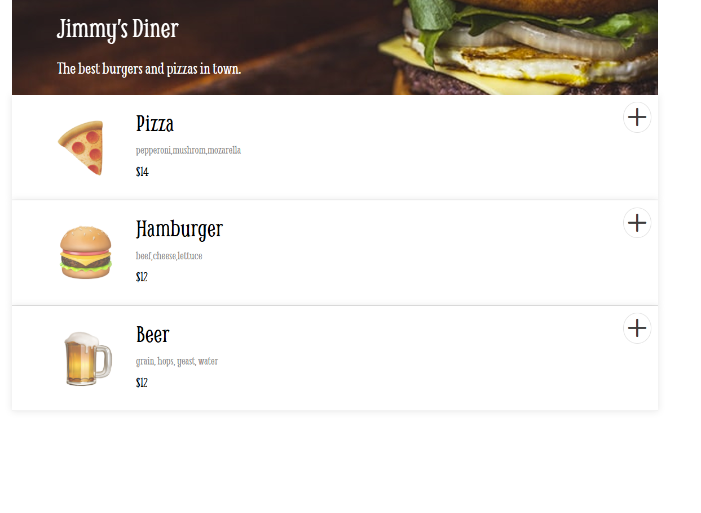
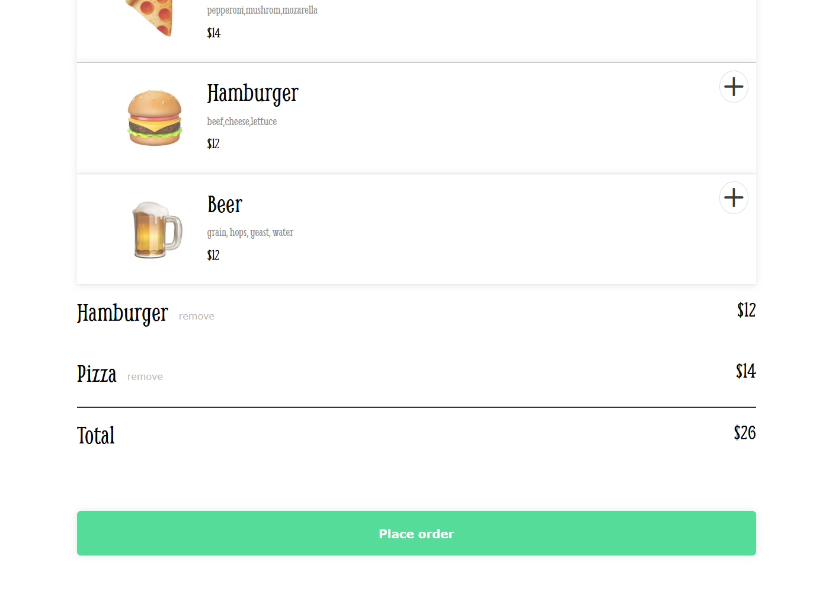
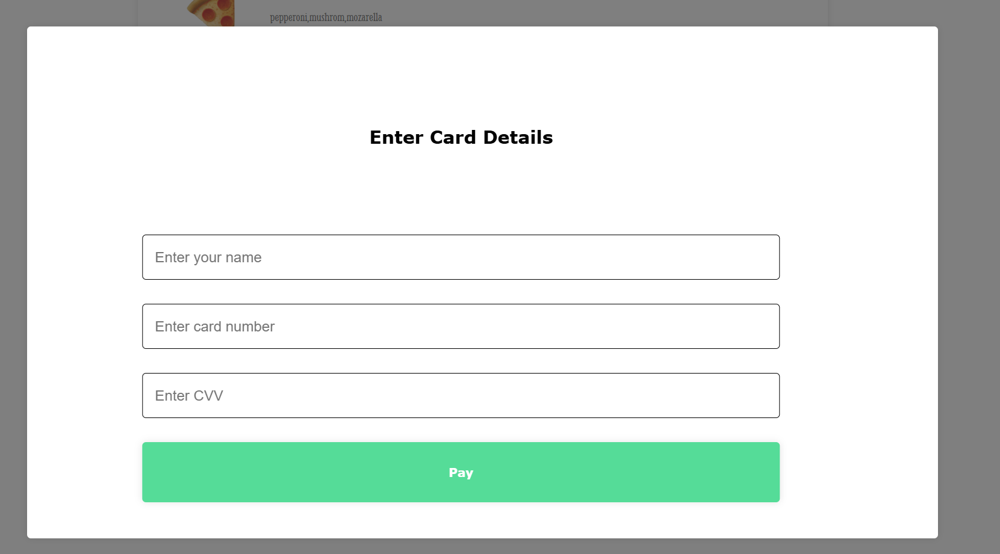

# Restaurant Ordering App

## Overview

Restaurant Ordering App is a web-based ordering system for restaurants that enables customers to browse the menu, create an order, and complete checkout using a built-in payment modal. The app features a dynamic interface with smooth animations and an overlay effect when the payment modal pops up.

## Features

- Dynamic menu items rendered from a JSON-like data file.
- Real-time order summary with a total price calculation.
- Modal pop-up for secure payment input.
- Interactive overlay that fades out the background when the modal is active.
- Responsive design optimized for multiple devices.

## Screenshots

### Home Screen



### Order Summary



### Payment Modal



## Technologies Used

- **HTML** for structure
- **CSS** for styling and layout
- **JavaScript (ES6 Modules)** for dynamic content management

## Installation

1. **Clone the Repository:**
   ```bash
   git clone https://github.com/yourusername/restaurant-ordering-app.git
   ```
2. **Open the Project:**
   Open the cloned folder in Visual Studio Code.
3. **Run the Application:**
   Open `index.html` in your browser or use a local development server. For example, if you have Node.js installed:
   ```bash
   npx live-server
   ```
   This will launch the application in your default browser.

## Usage

- **Browse the Menu:** View available items on the home screen.
- **Add Items:** Click the plus button on any menu card to add an item to your order.
- **Place an Order:** Click the "Place order" button to open the payment modal.
- **Complete Payment:** Fill in your name, card number, and CVV, then click "Pay" to finalize your order. A confirmation message will be displayed once your order is successfully placed.

## File Structure

```
restaurant-ordering-app/
├── data.js
├── index.js
├── index.html
├── index.css
├── README.md
└── screenshots/
    ├── home-screen.png
    ├── order-summary.png
    └── payment-modal.png
```

## Contributing

Contributions are welcome! If you have suggestions or improvements, please fork the repository and submit a pull request.

## License

This project is licensed under the MIT License. See the [LICENSE](LICENSE) file for details.

## Acknowledgements

- [Font Awesome](https://fontawesome.com/) for icons.
- [Google Fonts](https://fonts.google.com/) for typography.
- Thanks to all contributors and users!
